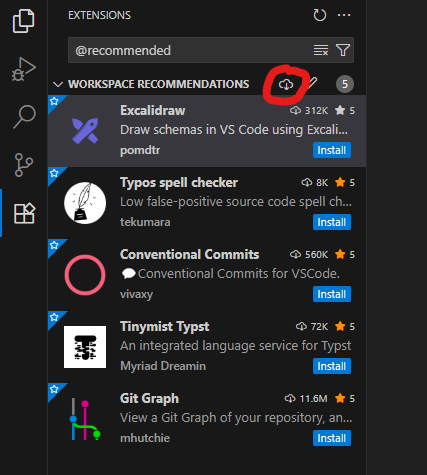
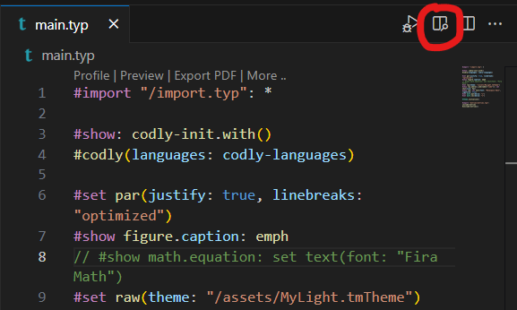

# 781X Notebook
This is the source code for Dark Matter 781x's notebook.

## Getting Started
<!-- TODO: The should probably be moved to its own file in the docs dir. -->
To get started:
1. Install Visual Studio Code [here](https://code.visualstudio.com/Download) and open it
2. Download the repository:
	1. Press `F1` to open command pallate
	2. Type in `Git: Clone` and press enter
	3. Select `Clone from GitHub`
	4. Type in `darkMatter781x/781X_NB` and press enter
	5. Select a folder to place the notebook in
3. Install necessary extensions
	1. Open command pallate again by pressing `F1`
	2. Type in `Extensions: Show Recommended Extensions` and press enter
	3. Install the extensions by pressing the install icon in the extensions window as shown here: 
		
		
4. Preview the notebook
	1. Press `Ctrl+P` (or `⌘P`) to open the Go to File prompt.
	2. Type in `main.typ` and press enter to open `main.typ`
	3. Then click the "Preview Opened file" button in the top right as show below (you may have to wait for the extensions load): 

		
5. See the [docs/docs.typ](./docs/docs.typ) for more information

# TODO:
- [ ] Add License

# Structure
- Section:
	- Largest subdivisions of the notebook. 
	- Each section will have its own page numbers. 
	- Must be one of the following:
		- Frontmatter 
			- Contains table of contents and the front cover.
			- Numbered with roman numerals (I).
		- Body 
			- Contains the notebook entries. 
			- Numbered with normal arabic numerals (1). 
		- Appendix 
			- Contains the index/glossary and bibliography.
			- Numbered with a prefix and arabic numerals: (A1).
- Fragment: 
	- Cannot be placed on the same page as another fragment.
	- All content must be part of a fragment.
	- A fragment cannot be broken up across sections.
	- Includes:
		- Table of contents
		- Front cover
		- Bibliography
		- Index/glossary
- fragment: 
	- Must be placed in the body section.
	- Each fragment has:
		- Title
		- Date
		- 1 design process step
		- 1 project
		- Content
	- Entries with the same date will belong to the same fragment (Entries can only share a page with other entries with the same date).
# Terms
- Project 
	- Something to which the design process is being applied
	- Used to distinguish between concurrent design processes
	- Includes:
		- Subsystems like intake, mogo clamp, etc.
		- Processes perhaps
		- Strategy perhaps
		- Program parts like MCL, intake code, opcontrol, etc. 